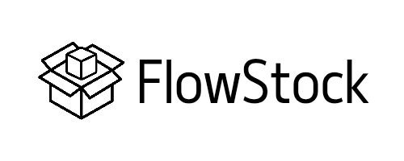

# 📦 FlowStock

**FlowStock** é uma plataforma voltada para o gerenciamento doméstico de estoques. O projeto foi idealizado para oferecer uma experiência intuitiva e eficiente, permitindo que diferentes usuários possam controlar e organizar seus estoques pessoais com facilidade.

---

## 🔑 Principais Funcionalidades

- ✅ Cadastro e login de usuários
- ✅ Criação e organização de estoques
- ✅ Adição de itens com quantidade e limite mínimo
- ✅ Atualização rápida das quantidades registradas
- ✅ Suporte a múltiplos usuários em um mesmo ambiente doméstico
- ✅ Interface limpa, responsiva e intuitiva
- ✅ Seção de FAQ com perguntas frequentes e tutoriais

---

## 🎨 Protótipo

O protótipo do sistema foi desenvolvido colaborativamente utilizando o software [Figma](https://www.figma.com/), com foco em:

- Criação e divisão de estoques por categorias
- Registro e gerenciamento de usuários
- Navegação intuitiva entre seções
- Interatividade planejada para facilitar o uso doméstico

---

## 💡 Tecnologias Utilizadas

- **Backend:** Django (Python)
- **Frontend:** HTML5, CSS3, Bootstrap 5
- **Banco de Dados:** SQLite (padrão Django)
- **Design de Interface:** Figma

---

**Dependencias do projeto:**

- Python 3.13.3

## 🚀 Como Executar Localmente

1. Clone o repositório:

```bash
git clone https://github.com/ImJotaM/FlowStock
cd FlowStock
```

2. Crie e ative um ambiente virtual python (venv):

```bash
python -m venv .venv

# Windows
.\.venv\Scripts\activate

# Posix
source ./.venv/bin/activate

```

3. Instale as dependencias:

```
pip install -r requirements.txt
```

4. Execute o projeto:

```bash
# Migre o projeto
python manage.py makemigrations
python manage.py migrate

# Execute
python manage.py runserver
```
